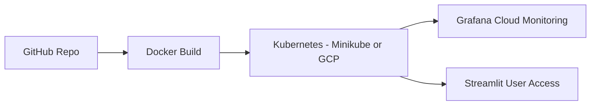
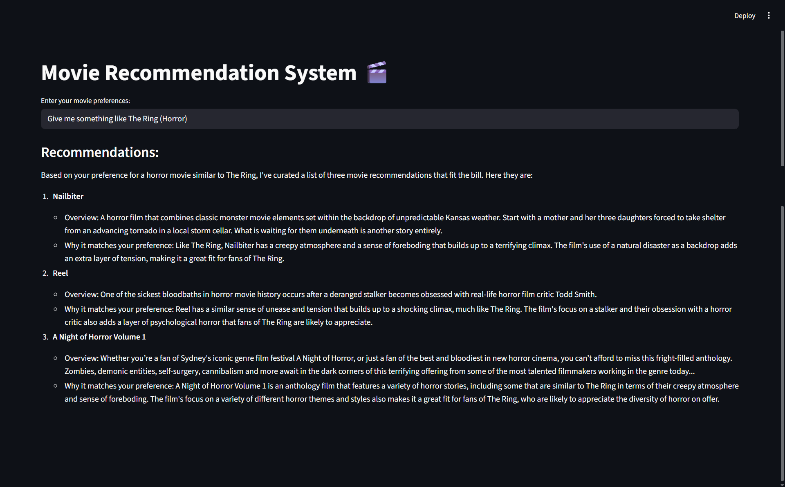
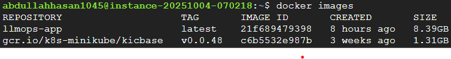
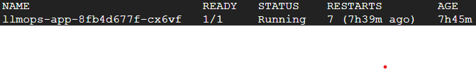
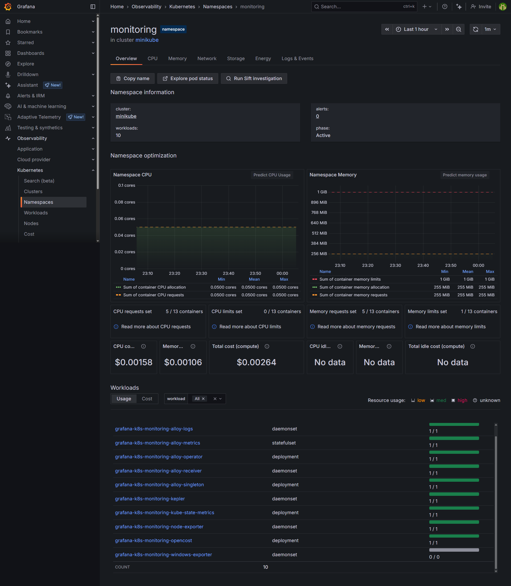

# Movie Recommender System (LLMOps + Cloud Deployment)


## Table of Contents
- [Overview](#-overview)
- [Architecture](#-architecture)
- [Tech Stack](#-tech-stack)
- [Setup Instructions](#-setup-instructions)
- [Deployment](#-deployment)
- [Monitoring with Grafana Cloud](#-monitoring-with-grafana-cloud)
- [Screenshots](#-screenshots)
- [Future Improvements](#-future-improvements)
- [License](#-license)

---

## Overview
This project implements a **Movie Recommendation System** powered by Large Language Models (LLMs).  
It demonstrates end-to-end **MLOps practices** including containerization, orchestration, cloud deployment, and monitoring.

---

## 🏗️ Architecture


---

## Tech Stack
- Frontend: Streamlit
- LLM APIs: Hugging Face Hub, Groq API
- Containerization: Docker
- Orchestration: Kubernetes (Minikube, kubectl)
- Cloud Provider: Google Cloud (VM, Ubuntu 24.04 LTS)
- Monitoring: Grafana Cloud + Helm
- Version Control: Git + GitHub

---

## Setup Instructions
### Clone Repository

bash
```
git clone https://github.com/AbdullahHasan0/MOVIE-RECOMMENDER-SYSTEM-LLMOPS.git
cd MOVIE-RECOMMENDER-SYSTEM-LLMOPS
```

### Create Virtual Environment

bash
```
python -m venv venv
source venv/bin/activate   # Mac/Linux
venv\Scripts\activate      # Windows
```

### Install Dependencies

bash
```
pip install -r requirements.txt
```

### Set Environment Variables

bash
```
GROQ_API_KEY=your_groq_api_key
HUGGINGFACEHUB_API_TOKEN=your_hf_token
```

Run Locally

bash
```
streamlit run app.py
```
---

## Deployment
### Build Docker Image

bash
```
docker build -t llmops-app:latest .
```

### Run with Minikube

bash
```
minikube start
eval $(minikube docker-env)

kubectl create secret generic llmops-secrets \
  --from-literal=GROQ_API_KEY="your_groq_api_key" \
  --from-literal=HUGGINGFACEHUB_API_TOKEN="your_hf_token"

kubectl apply -f llmops-k8s.yaml
kubectl get pods
Expose Service
```

bash
```
minikube tunnel
kubectl port-forward svc/llmops-service 8501:80 --address 0.0.0.0
```

### Visit your app at:

url
```
http://<EXTERNAL-IP>:8501
```

## Monitoring with Grafana Cloud
Create a Grafana Cloud account
Install Helm on your VM
Add Grafana repo and deploy monitoring stack:

bash
```
helm repo add grafana https://grafana.github.io/helm-charts
helm repo update
helm upgrade --install grafana-k8s-monitoring grafana/k8s-monitoring \
  --namespace "monitoring" --create-namespace --values values.yaml
```

### Verify:

bash
```
kubectl get pods -n monitoring
View metrics in Grafana Cloud Dashboard 🎉
```

## Screenshots

| Stage               | Screenshot |
|---------------------|-------------|
| **App UI**          |  |
| **Docker Build**    |  |
| **K8s Pods Running**|  |
| **Grafana Dashboard** |  |


## Future Improvements
- CI/CD pipeline with GitHub Actions
- Prometheus + Grafana advanced dashboards
- Horizontal Pod Autoscaling (HPA)
- Extend recommendation logic with RAG + vector DB
- Deployment to AWS ECS Fargate or EKS

## License
This project is licensed under the MIT License.
